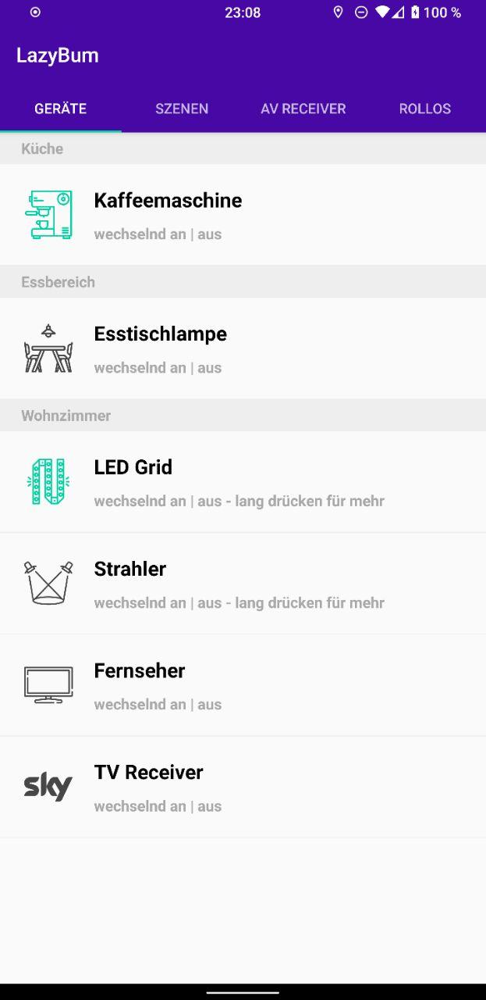
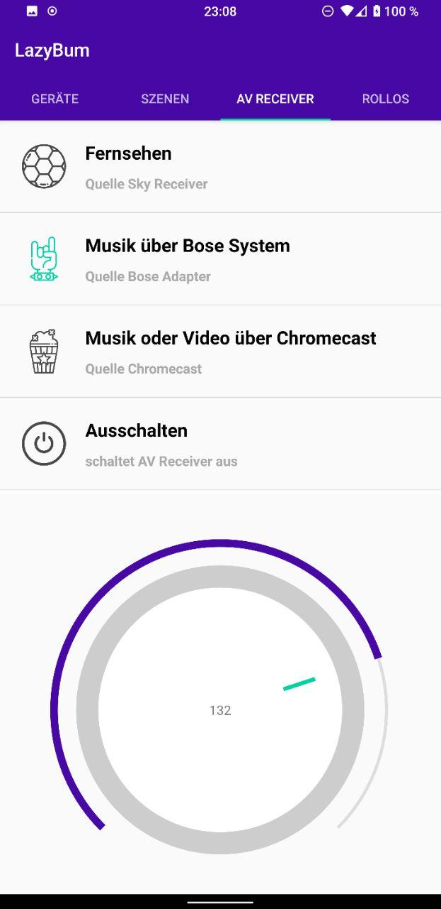

# LazyBum

_LazyBum_ is a highly customized home automation app that can serve as an inspiration and / or starting point for your own app. It integrates different kinds of home automation devices from brands, such as [Shelly](<https://shelly.cloud>) and [MyStrom](<https://mystrom.com>) and my own Arduino. The Arduino offers an API, which lets the app control peripherals like an AV Receiver (via UDP over Ethernet) and a Sky TV Receiver (via IR LED).

## Tabs

- 📦 **modular devices** can be switched on and off - some devices offer more features via alert dialog on long press
- 🌅 **scenes** (WIP) can control several devices at once
- 📺 **av receiver** for controlling the receiver's source and volume
- 🏠 **rollers** alternates between up, stop and down

## Screenshots

   Single Devices    |         AV Receiver      |
:-------------------------:|:-------------------------:
  |  

## Credits

### Icons

The icons used are downloaded from flaticons.com - thanks to
- 
<a href="https://www.flaticon.com/de/kostenloses-icon/kaffeemaschine_3234299?term=kaffeemaschine&page=1&position=7" title="xnimrodx">xnimrodx</a> from <a href="https://www.flaticon.com/de/" title="Flaticon">www.flaticon.com</a>

- 
<a href="https://www.flaticon.com/de/autoren/smashicons" title="Smashicons">Smashicons</a> from <a href="https://www.flaticon.com/de/" title="Flaticon">www.flaticon.com</a>

- 
<a href="https://www.flaticon.com/de/autoren/smalllikeart" title="smalllikeart">smalllikeart</a> from <a href="https://www.flaticon.com/de/" title="Flaticon">www.flaticon.com</a>

- 
<a href="https://www.flaticon.com/de/autoren/freepik" title="Freepik">Freepik</a> from <a href="https://www.flaticon.com/de/" title="Flaticon">www.flaticon.com</a>

### Dependencies

I implemented some awesome UI elements, special thanks to
- [Croller](<https://github.com/harjot-oberai/Croller>)
- [Colorpicker](<https://github.com/QuadFlask/colorpicker>)
- [RubberPicker](<https://github.com/Chrisvin/RubberPicker>)
